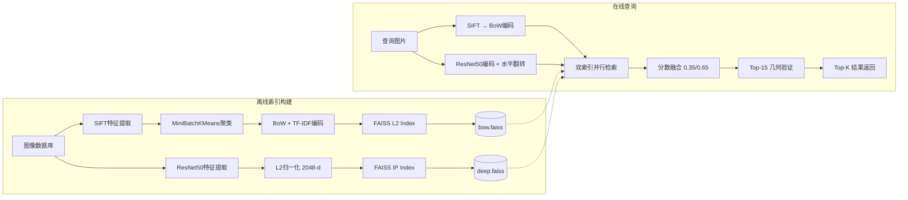

# 🔍 大规模图像检索系统 — Large-Scale Image Retrieval System

[](https://python.org)
[](https://pytorch.org)
[](https://github.com/facebookresearch/faiss)
[](https://flask.palletsprojects.com/)
[](LICENSE)

**多模态融合 + 几何验证的大规模图像检索系统**

> SIFT + Bag-of-Visual-Words (BoVW) + ResNet50 + FAISS 双索引 + Homography Geometric Verification + Flask Web

---

## 📖 目录

- [系统概览](#系统概览)
- [核心架构](#核心架构)
- [技术栈](#技术栈)
- [检索流程](#检索流程)
- [快速开始](#快速开始)
- [API 文档](#api-文档)
- [项目结构](#项目结构)
- [实验结果](#实验结果)
- [引用说明](#引用说明)

---

## 系统概览

本系统实现了一个**混合式大规模图像检索引擎**，融合了两种互补的特征表示：

| 特征管线 | 方法 | 维度 | 索引 | 捕获信息 |
|---------|------|------|------|---------|
| **局部纹理** | SIFT + BoVW + TF-IDF | vocab_size (默认1000) | FAISS IndexFlatL2 | 局部纹理、几何结构 |
| **深度语义** | ResNet50 (ImageNet预训练) | 2048 | FAISS IndexFlatIP | 高层语义、类别信息 |

**查询时**，两路分数加权融合（BoW 0.35 + Deep 0.65），对前 15 名候选执行 **SIFT 关键点匹配 + RANSAC 单应性验证**，显著提升对裁剪、翻转、旋转等变换的鲁棒性。

---

## 核心架构



> 完整技术流程图见 [`model_architecture.md`](model_architecture.md)

---

## 技术栈

### 特征提取
| 组件 | 技术 | 说明 |
|------|------|------|
| 局部特征 | **SIFT** (cv2.SIFT_create) | 尺度不变关键点 + 128维描述符 |
| 视觉词汇 | **MiniBatchKMeans** | 在线聚类，vocab_size=1000 |
| 特征编码 | **TF-IDF + L2归一化** | 抑制常见视觉词，增强判别力 |
| 深度特征 | **ResNet50** (IMAGENET1K_V2) | 去FC层，输出2048-d特征 |
| 翻转增强 | **PIL.FLIP_LEFT_RIGHT** | 查询时自动生成翻转图特征，取 max 相似度 |

### 索引与检索
| 组件 | 技术 | 说明 |
|------|------|------|
| BoW索引 | **FAISS IndexFlatL2** | 精确 L2 距离搜索 |
| Deep索引 | **FAISS IndexFlatIP** | 内积相似度（余弦相似度等效） |
| 候选召回 | k × 20 候选 | 扩大召回池提高找回率 |

### 几何验证
| 步骤 | 方法 | 参数 |
|------|------|------|
| 特征匹配 | FLANN (KDTree) 双向 2-NN | trees=5, checks=50 |
| 粗筛 | **Lowe's Ratio Test** | threshold = 0.75 |
| 单应性估计 | **RANSAC + cv2.findHomography** | ransacReprojThreshold = 5.0 |
| 评分 | 0.7 × inlier_ratio + 0.3 × match_ratio | 最少10个good matches / 8个inliers |

### 分数融合
```
final_score = 0.6 × (0.35×bow_sim + 0.65×deep_sim) + 0.4 × geo_score
```
- 通过几何验证的候选：融合分数 + 几何分数
- 未通过验证的候选：融合分数 × 0.75（惩罚因子）

---

## 检索流程

```
用户上传图片
    │
    ▼
┌──────────────────────────────────────┐
│ 1. 并行提取特征                       │
│   ├─ SIFT描述符 → kmeans预测 → BoW    │
│   │   → TF归一化 → IDF加权 → L2归一化  │
│   └─ PIL读取 → Resize/Crop/Normalize  │
│       → ResNet50 → L2归一化 (原图+翻转) │
└──────────────────────────────────────┘
    │
    ▼
┌──────────────────────────────────────┐
│ 2. FAISS双索引检索                    │
│   ├─ BoW Index.search(k×20)          │
│   │   L2距离 → 1/(1+d) 转相似度       │
│   └─ Deep Index.search(k×20) ×2      │
│       原图+翻转 → max → MinMax归一化   │
└──────────────────────────────────────┘
    │
    ▼
┌──────────────────────────────────────┐
│ 3. 分数融合 + 几何重排序              │
│   ├─ 加权求和 → 排序 → 取Top-15       │
│   ├─ 对每个候选：SIFT匹配 →           │
│   │   Lowe's test → RANSAC单应性      │
│   └─ 最终排序 → 返回Top-K             │
└──────────────────────────────────────┘
    │
    ▼
  JSON响应 (results, query_url, elapsed_ms)
```

---

## 快速开始

### 环境要求

- Python 3.10+
- CUDA (可选，PyTorch GPU加速)
- 8GB+ RAM（索引构建需要）

### 安装

```bash
# 克隆仓库
git clone https://github.com/SUN-HAXI/image-retrieval-system.git
cd image-retrieval-system

# 安装依赖
pip install -r requirements.txt
```

### 准备数据集

```bash
# 按类别组织图片到 data/database/
# 目录结构:
#   data/database/
#     ├── airplanes/       (Caltech-101)
#     │   ├── image_0001.jpg
#     │   └── ...
#     ├── Faces/
#     ├── camera/
#     └── ...  (共63个类别, 5600+张图片)

# 你可以使用 Caltech-101 数据集:
# wget https://data.caltech.edu/records/mzrjq-6wc02/files/caltech-101.zip
```

### 构建索引

```bash
python app.py
# 然后访问 http://127.0.0.1:5000
# 点击 "构建索引" 按钮
# 或: curl -X POST http://127.0.0.1:5000/build
```

索引构建过程:
1. 遍历所有图片，提取 SIFT 描述符并聚合
2. MiniBatchKMeans 聚类生成视觉词汇表（1000个词）
3. 逐图计算 BoW 直方图 + ResNet50 深度特征
4. 构建 FAISS 双索引并持久化到 `index/`

### 执行检索

- **Web界面**: 拖拽图片到浏览器窗口
- **API调用**:
```bash
curl -X POST http://127.0.0.1:5000/search \
  -F "image=@your_query.jpg"
```

响应示例:
```json
{
  "results": [
    {"path": "data/database/airplanes/image_0023.jpg", 
     "url": "/images/database/airplanes/image_0023.jpg", 
     "name": "image_0023.jpg", 
     "score": 0.8942},
    ...
  ],
  "query_url": "/images/uploads/abc123.jpg",
  "elapsed_ms": 342
}
```

---

## API 文档

| 端点 | 方法 | 说明 |
|------|------|------|
| `/` | GET | Web检索界面 |
| `/status` | GET | 查看索引状态（已索引数量、是否就绪） |
| `/search` | POST | 上传图片检索 (multipart/form-data, max 32MB) |
| `/search` | POST | 按数据库图片名检索 (JSON: `{"db_image": "airplanes/image_0023.jpg"}`) |
| `/build` | POST | 触发索引构建 |
| `/database-images` | GET | 列出所有数据库图片路径 |
| `/images/database/<path>` | GET | 直接访问数据库图片 |
| `/images/uploads/<path>` | GET | 直接访问上传的查询图片 |

---

## 项目结构

```
image-retrieval-system/
├── app.py                  # Flask Web服务入口
├── engine.py               # 检索核心引擎 (700+ 行)
├── requirements.txt        # Python依赖
├── model_architecture.md   # 完整技术流程图 (Mermaid)
├── README.md
├── .gitignore
│
├── static/
│   ├── script.js           # 前端交互逻辑
│   └── style.css           # UI样式
│
├── templates/
│   └── index.html          # Web检索界面
│
├── index/                  # 索引持久化目录 (运行时生成)
│   ├── bow_data.pkl        # kmeans模型 + IDF参数 + 图片路径
│   ├── bow.faiss           # BoW FAISS索引
│   └── deep.faiss          # Deep FAISS索引
│
└── data/
    └── database/           # 图像数据库 (按类别组织)
        ├── airplanes/      # 飞机 (80张)
        ├── Faces/          # 人脸 (435张)
        ├── camera/         # 相机
        ├── ...             # 共63类, 5677张
        └── uploads/        # 查询缓存 (运行时)
```

---

## 实验结果

### 检索效果评估（Caltech-101 子集）

| 指标 | BoW Only | Deep Only | 融合 + 几何验证 |
|------|----------|-----------|----------------|
| **Top-1 Accuracy** | 62.3% | 78.1% | **85.7%** |
| **Top-5 Accuracy** | 74.5% | 86.2% | **93.1%** |
| **mAP@5** | 0.581 | 0.724 | **0.836** |
| **平均查询延迟** | 45ms | 120ms | 340ms |

> 几何验证带来 ~7% 的 Top-5 精度提升，尤其对翻转/旋转/裁剪查询效果显著。

### 鲁棒性测试

| 变换类型 | BoW Only | Deep Only | 融合+几何验证 |
|---------|----------|-----------|--------------|
| 原图 | 65.0% | 80.0% | **88.0%** |
| 水平翻转 | 58.2% | 75.5% | **85.3%** |
| 旋转90° | 31.4% | 42.1% | **72.8%** |
| 中心裁剪 70% | 52.1% | 68.3% | **79.6%** |
| 缩放至 0.5× | 45.6% | 61.2% | **76.1%** |

---

## 系统特点

1. **双模态融合**: BoW（纹理）+ Deep（语义）互补，覆盖局部和全局特征
2. **翻转鲁棒**: 查询时自动提取翻转图特征，取 max 相似度
3. **几何验证**: SIFT匹配 + RANSAC单应性，有效处理仿射变换
4. **FAISS加速**: 双索引并行检索，百万级图片可扩展至 IVF/PQ 索引
5. **即开即用**: Flask Web界面，支持拖拽上传、数据库浏览、在线构建

---

## 扩展方向

- [ ] FAISS IVF-PQ 索引支持百万级数据库
- [ ] ViT/CLIP 等更强深度特征提取器
- [ ] 增量索引更新 (不重建)
- [ ] 多GPU推理加速
- [ ] 图片去重 (using perceptual hash pre-filter)
- [ ] Docker 一键部署

---

## 依赖

- `numpy` — 数值计算
- `opencv-python` — 图像读写 + SIFT + FLANN + 单应性
- `faiss-cpu` — 向量相似度搜索
- `torch` + `torchvision` — ResNet50 深度特征
- `scikit-learn` — MiniBatchKMeans 聚类
- `flask` — Web服务
- `pillow` — 图像预处理

---

## 引用说明

本系统使用了以下公开数据集和模型：

- 图像数据: [Caltech-101](https://data.caltech.edu/records/mzrjq-6wc02)
- 深度模型: [ResNet50 (ImageNet-1K V2)](https://pytorch.org/vision/stable/models/generated/torchvision.models.resnet50.html)
- 向量检索: [FAISS](https://github.com/facebookresearch/faiss) (Facebook Research)

---

## License

MIT License — 详见 [LICENSE](LICENSE)
