# 大规模图像检索系统 — 模型流程与结构图

> 下图完整展示了本系统的 **离线索引构建** 与 **在线查询检索** 两大阶段，每个阶段中的每一个技术/算法/操作均不省略，多次使用同样技术处均单独列出。

```mermaid
flowchart TB
    subgraph LEGEND["图例说明"]
        L1["📦 数据/存储"]:::storage
        L2["🔧 预处理"]:::preprocess
        L3["🧠 特征提取"]:::feature
        L4["📊 聚类/编码"]:::clustering
        L5["🗂️ 索引"]:::index
        L6["🔍 检索/匹配"]:::search
        L7["📐 几何验证"]:::geometry
        L8["📈 分数融合"]:::score
        L9["🌐 Web/API"]:::web
    end

    %% ================================================================
    %% OFFLINE: INDEX BUILDING
    %% ================================================================
    subgraph OFFLINE["🟦 离线阶段：索引构建 (build_index)"]
        direction TB

        A1["🖼️ 图像数据库\n(data/database/ 目录)"]:::storage
        A2["os.walk 遍历目录\n筛选 .jpg/.jpeg/.png/.bmp/.gif/.webp"]:::preprocess
        A3["排序并存入 image_paths 列表"]:::preprocess

        A1 --> A2 --> A3

        subgraph PER_IMAGE_BUILD["对每一张图片并行执行两条特征提取管线"]
            direction LR

            subgraph SIFT_PIPE_BUILD["SIFT 局部特征管线"]
                B1["cv2.imdecode\n(Unicode安全读取)"]:::preprocess
                B2["cv2.cvtColor\n(BGR → GRAY)"]:::preprocess
                B3["cv2.SIFT_create()\nSIFT 特征检测器初始化"]:::feature
                B4["sift.detectAndCompute()\n关键点检测 + 128维描述符提取"]:::feature
                B5["收集所有描述符\n(全部图片的描述符合并)"]:::feature
                B1 --> B2 --> B3 --> B4 --> B5
            end

            subgraph DEEP_PIPE_BUILD["ResNet50 深度特征管线"]
                C1["PIL.Image.open\n(RGB 读取)"]:::preprocess
                C2["T.Resize(256)\n缩放至 256×256"]:::preprocess
                C3["T.CenterCrop(224)\n中心裁剪 224×224"]:::preprocess
                C4["T.ToTensor()\n转为张量 [0,1]"]:::preprocess
                C5["T.Normalize\nmean=[0.485,0.456,0.406]\nstd=[0.229,0.224,0.225]"]:::preprocess
                C6["torch.nn.Sequential\n(ResNet50 去掉最后的 FC 层)\nweights=IMAGENET1K_V2"]:::feature
                C7["model.eval() + torch.no_grad()\n前向推理"]:::feature
                C8["np.linalg.norm\nL2 归一化 → 2048-d 向量"]:::feature
                C1 --> C2 --> C3 --> C4 --> C5 --> C6 --> C7 --> C8
            end
        end

        A3 --> PER_IMAGE_BUILD

        %% Vocabulary Building
        subgraph VOCAB["视觉词汇表构建 (build_vocabulary)"]
            D1["np.vstack\n堆叠所有图片的 SIFT 描述符"]:::preprocess
            D2["np.random.choice\n随机采样 ≤150,000 个描述符"]:::preprocess
            D3["sklearn.cluster.MiniBatchKMeans\nn_clusters=vocab_size(1000)\nbatch_size=2000, n_init=3\nrandom_state=42"]:::clustering
            D4["kmeans.fit()\n训练聚类中心 (视觉词汇)"]:::clustering
            D1 --> D2 --> D3 --> D4
        end

        B5 --> VOCAB

        %% BoW Encoding
        subgraph BOW_ENCODE["BoW 编码 (对每张图片)"]
            E1["kmeans.predict()\n描述符分配至最近视觉词"]:::clustering
            E2["np.bincount\n生成词频直方图 (histogram)"]:::clustering
            E3["TF 归一化\nhist / (sum(hist) + 1e-8)"]:::clustering
            E4["IDF 计算\nlog((N+1)/(df+1)) + 1.0"]:::clustering
            E5["TF × IDF 加权"]:::clustering
            E6["sklearn.preprocessing.normalize\nL2 归一化"]:::clustering
            E1 --> E2 --> E3 --> E4 --> E5 --> E6
        end

        D4 --> E1

        %% FAISS Index Building
        subgraph FAISS_BUILD["FAISS 双索引构建"]
            F1["faiss.IndexFlatL2\n创建 L2 距离索引\n(BoW 直方图维度)"]:::index
            F2["bow_index.add()\n写入所有 BoW 向量"]:::index
            F3["faiss.IndexFlatIP\n创建内积相似度索引\n(2048 维)"]:::index
            F4["deep_index.add()\n写入所有 Deep 向量"]:::index
            F1 --> F2
            F3 --> F4
        end

        E6 --> F1
        C8 --> F3

        %% Persistence
        subgraph PERSIST["索引持久化 (save_index)"]
            G1["pickle.dump\n保存: kmeans, idf, vocab_size,\nimage_paths → bow_data.pkl"]:::storage
            G2["faiss.serialize_index\nbow_index → bow.faiss"]:::storage
            G3["faiss.serialize_index\ndeep_index → deep.faiss"]:::storage
        end

        F2 --> G1
        F2 --> G2
        F4 --> G3
    end

    %% ================================================================
    %% ONLINE: QUERY SEARCH
    %% ================================================================
    subgraph ONLINE["🟧 在线阶段：查询检索 (search)"]
        direction TB

        Q1["📤 用户上传查询图片\n或选择库内图片"]:::web
        Q2["Flask request.files / request.get_json\n接收查询请求"]:::web
        Q3["cv2.imdecode\n(Unicode安全读取 → BGR)"]:::preprocess
        Q4["PIL.Image.open\n(RGB 读取)"]:::preprocess

        Q1 --> Q2 --> Q3
        Q1 --> Q2 --> Q4

        subgraph QUERY_FEATURE["查询图片特征提取"]
            direction LR

            subgraph QUERY_SIFT["SIFT + BoW 查询编码"]
                QS1["cv2.cvtColor\n(BGR → GRAY)"]:::preprocess
                QS2["cv2.SIFT_create()\nsift.detectAndCompute()\n关键点 + 128维描述符"]:::feature
                QS3["kmeans.predict()\n描述符 → 视觉词分配"]:::clustering
                QS4["np.bincount\n词频直方图"]:::clustering
                QS5["hist / sum(hist)\nTF 归一化"]:::clustering
                QS6["hist × idf\nIDF 加权"]:::clustering
                QS7["np.linalg.norm\nL2 归一化"]:::clustering
                QS1 --> QS2 --> QS3 --> QS4 --> QS5 --> QS6 --> QS7
            end

            subgraph QUERY_DEEP["ResNet50 查询编码"]
                QD1["PIL.Image.open → RGB"]:::preprocess
                QD2["T.Resize(256)"]:::preprocess
                QD3["T.CenterCrop(224)"]:::preprocess
                QD4["T.ToTensor()"]:::preprocess
                QD5["T.Normalize(ImageNet stats)"]:::preprocess
                QD6["ResNet50 (no FC)\nmodel.eval() + torch.no_grad()"]:::feature
                QD7["np.linalg.norm\nL2 归一化 → 2048-d"]:::feature

                QD8["PIL.Image.FLIP_LEFT_RIGHT\n水平翻转"]:::preprocess
                QD9["T.Resize(256)"]:::preprocess
                QD10["T.CenterCrop(224)"]:::preprocess
                QD11["T.ToTensor()"]:::preprocess
                QD12["T.Normalize(ImageNet stats)"]:::preprocess
                QD13["ResNet50 (no FC)\nmodel.eval() + torch.no_grad()"]:::feature
                QD14["np.linalg.norm\nL2 归一化 → 2048-d\n(翻转图特征)"]:::feature

                QD1 --> QD2 --> QD3 --> QD4 --> QD5 --> QD6 --> QD7
                QD1 --> QD8 --> QD9 --> QD10 --> QD11 --> QD12 --> QD13 --> QD14
            end
        end

        Q3 --> QUERY_SIFT
        Q4 --> QUERY_DEEP

        %% FAISS Search
        subgraph FAISS_SEARCH["FAISS 双索引检索"]
            FS1["faiss.IndexFlatL2.search()\nBoW 索引 L2 距离搜索\n返回 k×20 候选"]:::search
            FS2["L2 距离 → 相似度\nbow_sim = 1/(1+d)"]:::score
            FS3["faiss.IndexFlatIP.search()\nDeep 索引内积搜索 (原始图)\n返回 k×20 候选"]:::search
            FS4["faiss.IndexFlatIP.search()\nDeep 索引内积搜索 (翻转图)\n返回 k×20 候选"]:::search
            FS5["np.maximum\n取原始/翻转的 max 相似度"]:::score
            FS6["Min-Max 归一化\ndeep_sim = (d-d_min)/(d_max-d_min)"]:::score
        end

        QS7 --> FS1
        QD7 --> FS3
        QD14 --> FS4
        FS1 --> FS2
        FS3 --> FS5
        FS4 --> FS5
        FS5 --> FS6

        %% Score Fusion
        subgraph SCORE_FUSION["多模态分数融合"]
            SF1["加权求和生成候选列表\nbow_weight=0.35 × bow_sim\n+\ndeep_weight=0.65 × deep_sim"]:::score
            SF2["sorted(..., reverse=True)\n按融合分数降序排列"]:::score
            SF3["取前 15 个候选\n进入几何验证"]:::score
        end

        FS2 --> SF1
        FS6 --> SF1
        SF1 --> SF2 --> SF3

        %% Geometric Verification
        subgraph GEO_VERIFY["几何空间验证 (对前15候选逐一执行)"]
            GV1["cv2.imdecode\n读取候选图片 (BGR)"]:::preprocess
            GV2["cv2.cvtColor\n(BGR → GRAY) ×2\n查询图 + 候选图分别转灰度"]:::preprocess
            GV3["cv2.SIFT_create()\nsift.detectAndCompute() ×2\n查询图关键点+描述符\n候选图关键点+描述符"]:::feature
            GV4["cv2.FlannBasedMatcher\n(algorithm=1 KDTree, trees=5)\n(checks=50)"]:::geometry
            GV5["flann.knnMatch(k=2)\n对每个查询关键点找最近 2 个匹配"]:::geometry
            GV6["Lowe's Ratio Test\nm.distance < 0.75 × n.distance\n筛选 good matches"]:::geometry
            GV7{good matches ≥ 10?}:::geometry
            GV8["提取匹配点对坐标\nsrc_pts, dst_pts"]:::geometry
            GV9["cv2.findHomography\n(RANSAC, threshold=5.0)\n计算单应矩阵 M + mask"]:::geometry
            GV10{M ≠ None 且 inliers ≥ 8?}:::geometry
            GV11["inlier_ratio = inliers / len(good)\nmatch_ratio = len(good) / min(len(q_kp), len(c_kp))"]:::geometry
            GV12["geo_score = 0.7 × inlier_ratio\n+ 0.3 × match_ratio"]:::geometry
            GV13["geo_score = 0.0\n(验证失败)"]:::geometry

            GV1 --> GV2 --> GV3 --> GV4 --> GV5 --> GV6 --> GV7
            GV7 --"是"--> GV8 --> GV9 --> GV10
            GV7 --"否"--> GV13
            GV10 --"是"--> GV11 --> GV12
            GV10 --"否"--> GV13
        end

        SF3 --> GEO_VERIFY

        %% Final Scoring
        subgraph FINAL_SCORE["最终排序与输出"]
            H1["verified candidates:\nfinal_score = 0.6 × fusion_score\n+ 0.4 × geo_score"]:::score
            H2["non-verified candidates:\nfinal_score = fusion_score × 0.75\n(未验证惩罚因子)"]:::score
            H3["sorted(..., reverse=True)\n取 top-k (k=5)"]:::score
            H4["返回 JSON\n{results, query_url, elapsed_ms}"]:::web
        end

        GV12 --> H1
        GV13 --> H2
        H1 --> H3
        H2 --> H3
        H3 --> H4
    end

    %% ================================================================
    %% WEB LAYER
    %% ================================================================
    subgraph WEB["🌐 Web 服务层 (Flask)"]
        W1["Flask(__name__)\napp.run(host='0.0.0.0', port=5000, debug=True)"]:::web
        W2["GET / → render_template('index.html')\n前端界面"]:::web
        W3["GET /status → 索引状态 JSON"]:::web
        W4["POST /search → 图片检索 API\n(max 32MB 上传)"]:::web
        W5["POST /build → 触发索引构建 API"]:::web
        W6["GET /database-images → 列出库内图片"]:::web
        W7["GET /images/database/<name> → send_from_directory\n提供数据库图片"]:::web
        W8["GET /images/uploads/<name> → send_from_directory\n提供上传图片"]:::web
        W9["uuid.uuid4().hex → 上传图片唯一命名"]:::web
        W10["os.makedirs(..., exist_ok=True)\n自动创建所需目录"]:::web
    end

    %% Cross-links between phases
    PERSIST -.->|"加载已保存索引\npickle.load + faiss.deserialize_index"| ONLINE
    W4 --> Q1
    H4 --> W4

    %% ================================================================
    %% STYLES
    %% ================================================================
    classDef storage fill:#e8f5e9,stroke:#2e7d32,stroke-width:1.5px
    classDef preprocess fill:#e3f2fd,stroke:#1565c0,stroke-width:1.5px
    classDef feature fill:#fce4ec,stroke:#c62828,stroke-width:1.5px
    classDef clustering fill:#fff3e0,stroke:#e65100,stroke-width:1.5px
    classDef index fill:#f3e5f5,stroke:#6a1b9a,stroke-width:1.5px
    classDef search fill:#e0f7fa,stroke:#006064,stroke-width:1.5px
    classDef geometry fill:#fbe9e7,stroke:#bf360c,stroke-width:1.5px
    classDef score fill:#fff8e1,stroke:#f57f17,stroke-width:1.5px
    classDef web fill:#eceff1,stroke:#37474f,stroke-width:1.5px
```

---

## 技术清单汇总 (按使用频次统计)

| 类别 | 技术 / 算法 / 操作 | 使用位置 | 次数 |
|------|-------------------|---------|:--:|
| **图像读取** | `cv2.imdecode` (Unicode安全) | 构建阶段每图 ×1, 查询阶段 ×1, 几何验证每候选 ×1 | N+1+M |
| | `PIL.Image.open` (RGB) | 构建阶段每图 ×1, 查询阶段 ×1 | N+1 |
| | `PIL.Image.FLIP_LEFT_RIGHT` (水平翻转) | 查询阶段 ×1 | 1 |
| **颜色空间** | `cv2.cvtColor(BGR→GRAY)` | 构建 SIFT ×1, 查询 SIFT ×1, 几何验证 ×2(查询+候选) | 1+1+2M |
| **SIFT** | `cv2.SIFT_create()` | 构建阶段 ×1, 查询阶段 ×1, 几何验证 ×2(查询+候选) | 1+1+2M |
| | `sift.detectAndCompute()` | 同上 | 同上 |
| **图像变换** | `T.Resize(256)` | 构建每图 ×1, 查询 ×2(原图+翻转) | N+2 |
| | `T.CenterCrop(224)` | 同上 | N+2 |
| | `T.ToTensor()` | 同上 | N+2 |
| | `T.Normalize(ImageNet stats)` | 同上 | N+2 |
| **ResNet50** | `torch.nn.Sequential(*resnet[:-1])` | 构建每图 ×1, 查询 ×2(原图+翻转) | N+2 |
| | `model.eval()` + `torch.no_grad()` | 同上 | 同上 |
| | `weights=IMAGENET1K_V2` | 模型初始化 ×1 | 1 |
| **L2归一化** | `np.linalg.norm` (Deep特征) | 构建每图 ×1, 查询 ×2(原图+翻转) | N+2 |
| | `np.linalg.norm` (BoW查询直方图) | 查询阶段 ×1 | 1 |
| | `sklearn.preprocessing.normalize(L2)` (BoW构建) | 构建阶段 ×1 (批量) | 1 |
| **聚类** | `sklearn.cluster.MiniBatchKMeans` | 词汇表构建 ×1 | 1 |
| | `np.random.choice` (采样) | 词汇表构建 ×1 | 1 |
| | `kmeans.predict()` (编码) | 构建每图 ×1, 查询 ×1 | N+1 |
| **直方图** | `np.bincount` | 构建每图 ×1, 查询 ×1 | N+1 |
| **TF-IDF** | TF: `hist / sum(hist)` | 构建 ×1 (批量), 查询 ×1 | 2 |
| | IDF: `log((N+1)/(df+1)) + 1.0` | 构建 ×1 | 1 |
| | TF×IDF 加权 | 构建 ×1, 查询 ×1 | 2 |
| **FAISS** | `faiss.IndexFlatL2` (创建+搜索) | 构建 ×1 + 查询 ×1 | 2 |
| | `faiss.IndexFlatIP` (创建+搜索) | 构建 ×1 + 查询 ×2(原图+翻转) | 3 |
| | `faiss.serialize_index` / `faiss.deserialize_index` | 保存/加载各 ×2(BoW+Deep) | 4 |
| **分数转换** | `1/(1+d)` L2距离→相似度 | 查询 ×1 | 1 |
| | Min-Max 归一化 | 查询 ×1 | 1 |
| | `np.maximum` (原图/翻转取max) | 查询 ×1 | 1 |
| **分数融合** | 加权求和 0.35×BoW + 0.65×Deep | 查询 ×1 | 1 |
| | `sorted(reverse=True)` | 查询 ×2(融合排序+最终排序) | 2 |
| **FLANN匹配** | `cv2.FlannBasedMatcher(KDTree, trees=5, checks=50)` | 几何验证每候选 ×1 | M |
| | `flann.knnMatch(k=2)` | 同上 | M |
| **Lowe's Test** | `m.distance < 0.75 × n.distance` | 同上 | M |
| **单应性** | `cv2.findHomography(RANSAC, 5.0)` | 同上 | M |
| **几何评分** | `0.7×inlier_ratio + 0.3×match_ratio` | 同上 | M |
| **最终评分** | `0.6×fusion + 0.4×geo` (已验证) | 前15候选 ×1 | M |
| | `fusion × 0.75` (未验证惩罚) | 其余候选 ×1 | K-M |
| **序列化** | `pickle.dump` / `pickle.load` | 构建保存 ×1, 查询加载 ×1 | 2 |
| **Web** | `Flask` (路由/JSON/file upload) | 全系统 | — |
| | `uuid.uuid4().hex` (唯一命名) | 上传 ×1 | 1 |
| | `send_from_directory` (静态文件) | 图片服务 ×2 路由 | — |

> 注：N = 数据库图片数量, M = 几何验证候选数(≤15), K = 最终返回结果数(默认5)
